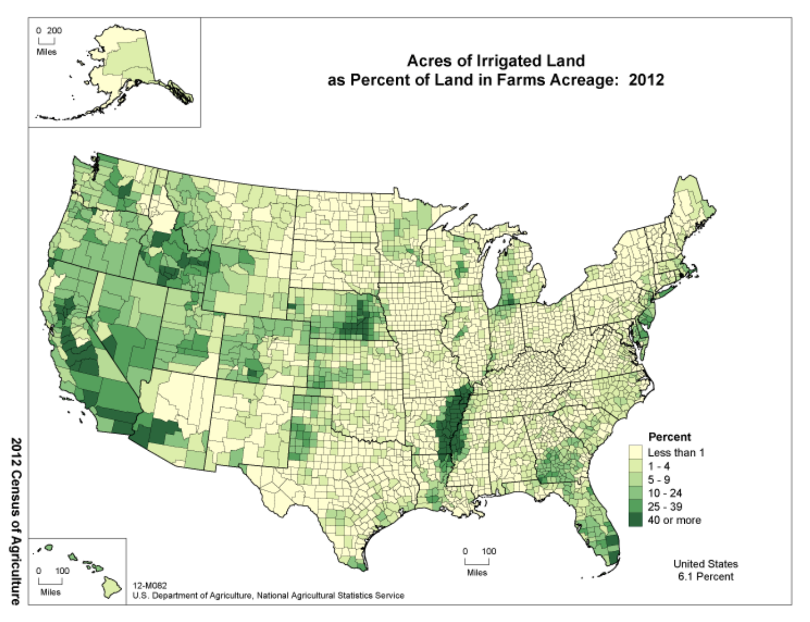
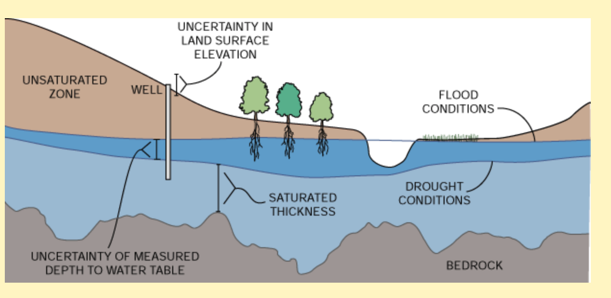
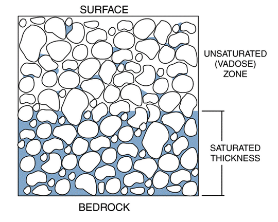
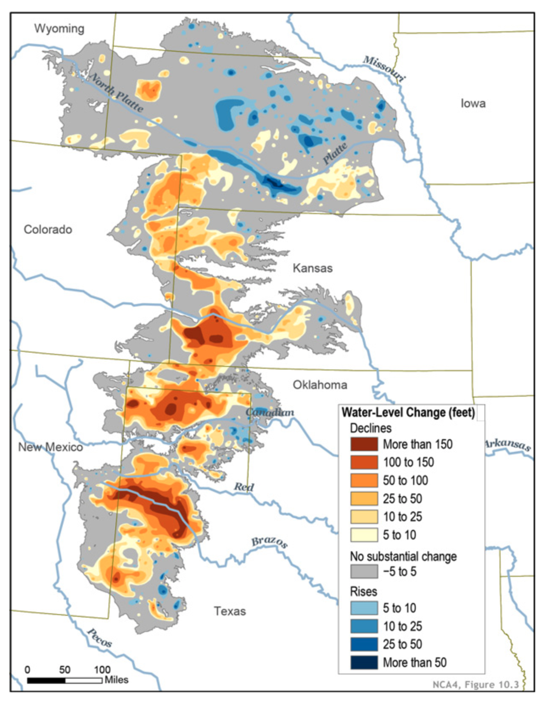

class: middle

```{r, child = 'setup.Rmd'}
```

```{r, include = F}
#--- load packages ---#
suppressMessages(library(data.table))
suppressMessages(library(tidyverse))
suppressMessages(library(DT))
suppressMessages(library(sf))
suppressMessages(library(here))
suppressMessages(library(tidycensus))
suppressMessages(library(tmap))
```

```{r tmap-layout}
tm_layout_to_add <- 
  tm_layout(
    legend.outside = "TRUE",
    frame = FALSE,
    legend.title.size = 2,
    legend.text.size = 1.5
  )  
```

```{r figure_setup, cache = F}
theme_update(
  axis.title.x =
    element_text(
      size = 9, angle = 0, hjust = .5, vjust = -0.3, face = "plain"
    ),
  axis.title.y =
    element_text(
      size = 9, angle = 90, hjust = .5, vjust = .9, face = "plain"
    ),
  axis.text.x =
    element_text(
      size = 7, angle = 0, hjust = .5, vjust = 1.5, face = "plain"
    ),
  axis.text.y =
    element_text(
      size = 7, angle = 0, hjust = 1, vjust = 0, face = "plain"
    ),
  axis.ticks =
    element_line(
      size = 0.3, linetype = "solid"
    ),
  axis.ticks.length = unit(.15, "cm"),
  #--- legend ---#
  legend.text =
    element_text(
      size = 7, angle = 0, hjust = 0, vjust = 0, face = "plain"
    ),
  legend.title =
    element_text(
      size = 7, angle = 0, hjust = 0, vjust = 0, face = "plain"
    ),
  legend.key.size = unit(0.5, "cm"),
  #--- strip (for faceting) ---#
  strip.text = element_text(size = 7),
  #--- plot title ---#
  plot.title = element_text(family = "Times", face = "bold", size = 9),
  #--- margin ---#
  # plot.margin = margin(0, 0, 0, 0, "cm"),
  #--- panel ---#
  panel.grid.major = element_blank(),
  panel.grid.minor = element_blank(),
  panel.background = element_blank(),
  panel.border = element_rect(fill = NA)
)
```


# Outline

1. [Research: The Impact of Saturated Thickness on Production Resiliency to Drought](#res1)
2. [Introduction to Getting a Graduate Degree in U.S.](#study-abroad)
3. [How to learn English](#english)

---

class: inverse, center, middle
name: intro

# The Impac of Saturated Thickness on Production Resiliency to Drought

<html><div style='float:left'></div><hr color='#EB811B' size=1px width=796px></html>

---
class: middle

# Background: Drought and Irrigation

+ Drought: lack of water for crop growth
  * Lack of precipitation
  * High evapotranpiration (how much water is transpied and lost from the soil), driven by high temperature and other meteorological factors
+ Drought is considered to worsen in the future due to cliamte change
+ Irrigation can counter the negative impact of drought
  * surfacewater (river, lake)
  * groundwater (aquifer)

---

```{r  echo = F, out.width = "80%"}

```

<br>

Source: [USDA](https://www.nass.usda.gov/Publications/AgCensus/2012/Online_Resources/Ag_Atlas_Maps/Farms/Land_in_Farms_and_Land_Use/12-M082.php)

---

# The Scope of the Study: Ogallala Aquifer


```{r scope-study-HP, cache = TRUE, out.width = "70%", eval = T}
root_dir <- "/Users/tmieno2/Dropbox/ResearchProjects/WaterEconomics/DroughtRiskAquifer"  

hpa_simplified <-
  file.path(root_dir, "Shared/Data/ProcessedData/hp_simplified.shp") %>%
  readRDS()     

data(fips_codes)

all_counties <-
  tigris::counties() %>% 
  rename(
    state_code = STATEFP, 
    county_code = COUNTYFP,
    county_name = NAME
  ) %>% 
  left_join(., fips_codes, by = c("state_code", "county_code")) %>% 
  dplyr::select(state_code, state, county_code, county_name) %>% 
  mutate(sc_code = paste0(state_code, county_code)) %>% 
  data.table() 

all_states <- 
  tigris::states() %>% 
  rename(state_code = STATEFP) %>% 
  left_join(
    ., 
    unique(data.table(fips_codes), by = "state"), 
    by = "state_code"
  ) %>% 
  st_transform(st_crs(hpa_simplified))

states_int <- all_states[hpa_simplified, ]

tm_shape(states_int) +
  tm_polygons(col = NA) +
  tm_text(text = "NAME", size = 0.7, col = "blue") +
tm_shape(hpa_simplified) +
  tm_polygons(col = "red", alpha = 0.4) +
tm_layout_to_add

```    

---
class: middle

# Saturated Thickness


```{r  echo = F, out.width = "80%"}

```

<br>

Source: [Kansas Geological Survey](https://www.kgs.ku.edu/HighPlains/atlas/apst.htm)

---


```{r  echo = F, out.width = "80%"}

```

<br>
Source: [Kansas Geological Survey](https://www.kgs.ku.edu/HighPlains/atlas/apst.htm)

---

# Groundwater Depletion (Decline in Saturated Thickness)

.left4[

<br>

+ Changes in Saturated Thickness: 
  * pre-developement to 2015
+ 1 feet = 30 cm
]

.right6[
```{r  echo = F, out.width = "80%"}

```

(Source: USGS)

]

---
class: middle

# Problems Associated with Groundwater Depletion

## Pumping Cost

The distance from the water to the surface increases, resulting in higher costs of pumping (energy cost).

## Well Yield (more important)

+ **Definition**: the amount of water you can pump out from the aquifer for a given period of time (often measured in gpm: gallons per minute)

+ **Why matters?**: if well yield is low, then farmers cannot keep up with daily water demand by crop, leading to loss in crop yield.
   
+ As saturated thickness goes down, well yield goes down, which means that farmers are more vulnerable to drought 

---
class: middle

# The Impact of Decline in Saturated Thickness

## Consequences

+ Crop yields from irrigated fields decline (<span style="color:blue"> intensive margin </span>)
+ Farmers revert back to dryland (no irrigation) production, which is accompanied by reduction in yield (<span style="color:blue"> extensive margin </span>)
+ Switch to a crop that is more drought-resistant (<span style="color:blue"> extensive margin </span>)

---
class: middle

# Knowledge Gap

+ Numerous studies have examined the impact of weather on crop yield from <span style="color:red"> dryland </span> production, but not from <span style="color:blue"> irrigated </span> production. 
+ Previous studies on the impact of weather on groundwater-irrigated production did not recognize that the impact of weather can be substantially different based on the level of saturated thickness

---
class: middle

# Research Goals and Method

## Goals

+ Empirically quantify the impact of weather on crop yield based on the level of saturated thickness 
+ Empirically identify the impact of saturated thickness on the share of irrigated production (percentage of irrigated production area)
+ Estimate the impact of saturated thickness on crop yield 

## Method

+ Regression analysis of yield and the share of irrigated production

---
class: middle

```{r }
viz_data_yield <- 
  readRDS(here("Kobe_University", "viz_data_yield.rds")) %>% 
  unnest() %>% 
  data.table()

viz_data_share <- 
  readRDS(here("Kobe_University", "viz_data_share.rds")) %>% 
  unnest() %>% 
  data.table()

data_for_sum <-
  here("Kobe_University", "data_for_summary.rds") %>% 
  readRDS()  
  
sum_data <- 
  data_for_sum$data_int[[1]]

```

# Scope of the Study

+ Geographic focus: counties that are spatially intersecting the Ogallala aquifer
+ Crops: corn and soybean
+ Analysis unit: County
+ Temporal dimension and resolution: `r min(sum_data$year)`-`r max(sum_data$year)` (observed annually) 

---
class: middle

# Data: Unbalanced Panel

+ County-level yield and acres from USDA-NAA [Quick Stats](https://www.nass.usda.gov/Quick_Stats/)
  * dryland
  * irrigated
+ Raw weather data from [gridMET](https://www.climatologylab.org/gridmet.html)
  * precipitation
  * temperature
  * humidity
  * wind speed
+ Constructed weather variables (summed over April through September)
  * evapotranspiration (ET)
  * water balance (WB) = precipitation - evapotranspiration 
  * extreme degree days (EDD)
+ Saturated thickness from Haacker, Kendall, and Hyndman (2016)
  * saturated thickness quintiles: dryland (0), [29.6,55.7], (55.7,85], (85,161], (161,271], (271,708]

---

# Water Balance Distribution

```{r fig.dim = c(6, 4)}
data_for_sum %>% 
  .[crop == "corn",] %>% 
  pull(data_int) %>% 
  .[[1]] %>% 
  ggplot(data = .) +
  geom_boxplot(aes(y = voi, x = factor(year)), size = 0.3, outlier.size = 0.2) +
  ylab("Balance (precipitation - ET)") +
  xlab("Year") +
  theme(
    axis.text.x = element_text(angle = 90)
  )


```

---

# Saturated Thickness Distribution

```{r fig.dim = c(6, 4)}
data_for_sum %>% 
  .[crop == "corn",] %>% 
  pull(data_int) %>% 
  .[[1]] %>% 
  .[sat != 0, ] %>% 
  ggplot(data = .) +
  geom_histogram(aes(x = sat), binwidth = 20, fill = NA, color = "blue") +
  xlab("Saturated Thickness (feet)") +
  ylab("Count")


```

---

# Yield and Balance

```{r fig.dim = c(6, 4)}
data_for_sum %>% 
  .[, .(crop, data_int)] %>% 
  unnest() %>% 
  data.table() %>%  
  .[, type := fifelse(sat_cat == "dryland", "Dryalnd", "Irrigated")] %>% 
  .[, crop_type := fifelse(crop == "corn", "Corn", "Soybean")] %>% 
  ggplot(data = .) +
  geom_point(aes(y = yield * 12.553 / 200, x = voi, color = type), size = 0.1) +
  geom_smooth(aes(y = yield * 12.553 / 200, x = voi, color = type), size = 0.6) +
  facet_grid(crop_type ~ ., scales = "free_y") +
  scale_color_discrete(name = "") +
  ylab("Yield (tons/ha)") +
  xlab("Balance (Precipitation - ET)")


```


---

# Econometric Model: Yield Regression

## Verbal representation
Semi-parametrically estimate the impact of water balance (precipitation - ET) on yield for each of the saturated thickness level category controlling for EDD, individual and year fixed effects.

## Mathematical representation

$$y_{i,t} = \beta_0 + \sum_{s=1}^6 \sum_{k=1}^K \gamma_k f_k(WB_{i,t})\cdot SC_{i,t,s} + \sum_{s=1}^6 \phi_k SC_{i,t,s} + \lambda EDD_{i,t} + \alpha_i + \theta_t + \varepsilon_{i,t}$$

+ <span style="color:blue"> $y_{i,t}$ </span>: crop yield at county $i$ in year $t$
+ <span style="color:blue"> $WB_{i,t}$ </span>: water balance (precipitation - ET)
+ <span style="color:blue"> $SC_{i,t,s}$ </span>: dummy variable that indicates which saturated thickness category the observation is in
+ <span style="color:blue"> $\alpha_i$ </span>: county fixed effect
+ <span style="color:blue"> $\theta_t$ </span>: year fixed effect
+ <span style="color:blue"> $\varepsilon_{i,t}$ </span>: error term


---

# Econometric Model: Irrigation Share Regression

## Verbal representation
Estimate the impact of saturated thickness on the share of irrigated acres controlling for WB, EDD, and year fixed effects.

## Mathematical representation (fractional logit model)

$$IRS_{i,t} = \beta_0 + \beta_1 SAT_{i,t} + \beta_2 SAT_{i,t}^2 + \beta_2 WB_{i,t} + \beta_3 EDD_{i,t} + \theta_t + \mu_{i,t}$$

+ <span style="color:blue"> $IRS_{i,t}$ </span>: share of irrigated acres for county $i$ in year $t$ (ranges from 0 to 1)
+ <span style="color:blue"> $\theta_t$ </span>: year fixed effect
+ <span style="color:blue"> $\mu_{i,t}$ </span>: error term


---

```{r }

g_corn_i <- 
  ggplot(viz_data_yield[crop == "corn", ]) +
  geom_line(aes(y = y_hat * 12.553 / 200, x = voi, color = factor(sat_cat_q))) +
  xlab("Balance (Precipitation - ET0)") +
  ylab("Yield (ton/ha)") +
  scale_color_discrete(name = "") +
  theme(
    legend.position = "bottom"
  )

g_soy_i <- 
  ggplot(viz_data_yield[crop == "soy", ]) +
  geom_line(aes(y = y_hat * 12.553 / 200, x = voi, color = factor(sat_cat_q))) +
  xlab("Balance (Precipitation - ET0)") +
  ylab("Yield (ton/ha)") +
  scale_color_discrete(name = "") +
  theme(
    legend.position = "bottom"
  )

```

# Regression Results: Irrigated Corn Yield


```{r fig.dim = c(6, 4)}
g_corn_i 
```

---

# Regression Results: Irrigated Soybean Yield

```{r fig.dim = c(6, 4)}
g_soy_i 
```

---

# Regression Results: Share of Irrigated Production

```{r fig.dim = c(6, 4)}
ggplot(viz_data_share) +
  geom_line(aes(y = ir_share_hat, x = sat)) +
  ylim(0, NA) +
  xlab("Saturated Thickness (meter)") +
  ylab("Share of Irrigated Acres") +
  facet_grid(. ~ crop)

```

---

# The Impact of Saturated Thickness on Average Yield (Combined Effect)

Saturated thickness affects average yield via two channels:

+ crop yield on irrigated fields
+ share of irrigated production area

We looked at them individually. Now combine them to understand the overall average impact.

--

$$\mbox{Average Yield(WB, Sat)} = IrY(WB, Sat) * \tau(Sat) +  DrY(WB) * (1 - \tau(Sat))$$

+ <span style="color:blue"> $IrY$ </span>: irrigated yield
+ <span style="color:blue"> $DrY$ </span>: dryland yield
+ <span style="color:blue"> $WB$ </span>: water balance
+ <span style="color:blue"> $Sat$ </span>: saturated thickness
+ <span style="color:blue"> $\tau$ </span>: share of irrigated production area

```{r }
data_avg <- 
  data_for_sum %>% 
  .[, .(crop, pred_data)] %>% 
  unnest() %>% 
  data.table() %>% 
  .[, sat := factor(sat, level =c("29.6", "55.7", "85", "161", "271", "Dryland"))]

```

---

# Corn


```{r fig.dim = c(6, 4)}
ggplot(data_avg[crop == "corn", ]) +
  geom_line(aes(y = avg_yield * 12.553 / 200, x = voi, color = factor(sat))) + 
  xlab("Balance (Precipitation - ET)") +
  ylab("Average Yield (tons/ha)")  

```

---

# Soybean


```{r fig.dim = c(6, 4)}
ggplot(data_avg[crop == "soy", ]) +
  geom_line(aes(y = avg_yield * 12.553 / 200, x = voi, color = factor(sat))) + 
  xlab("Balance (Precipitation - ET)") +
  ylab("Average Yield (tons/ha)")  

```

---
class: middle

# Conlusion

+ The impact of weather on groundwater-irrigated crop yield varies substantially based on the level of saturated thickness of the aquifer 
+ Declines in saturated thickness
  * lower irrigated yield   
  * lower the share of irrigated production area
+ It is economically valuable to maintain high-level of saturated thickness to support robust irrigated production

---

class: inverse, center, middle
name: intro

# Agricultural Economics Masters and Ph.D. in U.S.

<html><div style='float:left'></div><hr color='#EB811B' size=1px width=796px></html>

---
class: middle
# My path

.content-box-green[**Bachelor's Degree**]

Forest Policy, Faculty of Agriculture, Hokkaido University

+ When I was a junior (third year), I realized that I did not want to work in Japan (my GPA was below at this point) 
+ I wanted to live in U.S., so I decided to do Master's in U.S.
+ I started to study for TOEFL and take ECON classes to improve my GPA 
+ I was not sure whether I wanted to do Ph.D. at this point

---
class: middle
# My path

.content-box-green[**Master's Degree**]

Agricultural and Consumer Economics, University of Illinois at Urbana Champaign (UIUC)

+ I studied and worked as a fully-funded RA (about $18,000 per year of salary, tuition waiver, other benefits) for two years (this is not uncommon at all in Agricultural and Applied Economics Master's programs)
+ I decided to do Ph.D. as I loved what I was doing

---
class: middle
# My path

.content-box-green[**Doctorate Degree (Ph.D.)**]

Agricultural and Applied Economics, UIUC

+ 1st year: fellowship (getting paid to study, no need to help with research or teach)
+ 2nd year: RA
+ 3rd year: RA
+ 4th year: RA and TA
+ 5th year: RA and TA

All fully funded (salary + tuition waiver + benefits)

---
class: middle

.left5[
## Pros
+ opportunities to work with world-leading researchers 
+ improve English skills (especially speaking)
+ better job prospects world wide 
+ interact with people with diverse background
+ (mostly) better financial support
  * tuition waiver
  * salary
]

.right5[
## Cons

+ risk to get kicked out of the program for failing qualifying exam (Ph.D.)
+ struggles with English (especially at an early stage) 
+ cultural difference 
+ limited Japanese grocery and food options 
+ some level of discrimination 
+ high travel cost to Japan
+ less opportunities to meet with family or friends in Japan
+ politics

]

---
class: middle


# Debunking misconceptions: Finance

.content-box-green[**You or your parents do not have to be wealthy**]

--

+ "I don't have money" is not a reason you should give up on getting a graduate degree in U.S. 
+ Majority of Ph.D students in Applied Econ Ph.D. programs in U.S. are funded by the department (no string attached)
+ Many <span style="color:blue"> Master's </span> program in Agricultural and Applied Economics offer financial aids to students with no string attached (This is not the case for many other fields). 
+ UIUC as an example 
  * Master's in Agricultural and Consumer Economics: almost **everybody** is funded by the department
  * Master's in Economics: (almost) **nobody** is funded (almost everybody is self-funded)
+ Paths to getting Ag/Applied Econ Ph.D. in U.S. 
  * Get Master's in U.S. with funding, and get Ph.D. in U.S. with funding
  * Get Master's in Japan, and get Ph.D. in U.S. with funding (more popular)

--

.content-box-red[**Of course, you need to prove that you are worthy of funding from the department.**]


---
class: middle

# Debunking misconceptions: Finance

.content-box-green[**Funding types**]

+ Fellowship
+ Research Assistant (RA)
+ Teaching Assistant (TA)

They almost always come with

+ Salary (typically around $24,000 per year)
+ Tuition waiver (no need to pay for classes you take)
+ Benefits (insurance, etc)

--

.content-box-red[**Important**]: You do NOT have to pay back! It is not a loan.

---
class: middle

# Debunking misconceptions: Finance

.content-box-green[**What are the cost items?**]

+ Resources to study for tests (few hundred dollars at maximum)
+ Test (TOEFL, GRE) fees ($185 for TOEFL, and $205 for GRE)
+ Application fees (about $70 per school)
+ Airplane ticket 
+ Living costs from April to August (of course you may be able to stay at your parents' house and minimize the cost) 

---
class: middle

# Debunking misconceptions: Who


.content-box-green[**Getting a graduate degree in U.S. is not just for elites**]

+ Students' ability in U.S. graduate degree programs vary enormously. 
+ From what I have seen, any person who is as capable as entering Kobe University CAN survive and get a graduate degree in U.S. (I am not saying it is easy) 
+ Not everybody can go to a top school like UC Berkeley or Davis. However, there are plenty schools in U.S. that will make you are a strong job candidate in a wide variety of job markets
  * Cornell, Ohio State, Kansas State, Oregon State, U of Illinois, Maine, North Carolina, Arizona State, U of Connecticut, and many more
+ Applied Econ Ph.D. degree from a middle-rank school is still very valuable 

---
class: middle

# Debunking misconceptions: Who


.content-box-green[**Getting a graduate degree in U.S. is not just for those who are devoted to research**]

+ Not many Ph.D. degree holders get to stay in academia and do just research (and teaching). 
+ But, there are of course tons of non-academic jobs and they tend to pay better in general at least in U.S. 
+ There is nothing wrong with considering Master's and Ph.D. programs as high-end vocational schools (except that you are not paying, but getting paid), earn skills, and get a high-paying job in the private sector. 

---
class: middle

# Job Prospects: Master

+ On average, a person with Masters's degree earns $78K/year (approximately 8800,000 Yen per year) in U.S.
+ There is a huge difference in salary depending on the kind of degree one has 
  * Agricultural economists make more than average
+ What kind of jobs and companies?
  * Researcher (e.g., IFPRI, World Bank)
  * Consulting 
  * Data scientist (Cargill, Apple, Facebook, etc)
+ Since you are a foreigner, you need to find a employer who is willing to work with you to get you VISA to work in U.S. for an extended period of time after OPT 

---
class: middle

# Job Prospects: Ph.D.

+ Job prospects get even better with Ph.D. (as it should be after suffering 4 or 5 more years). I have never seen a person with Ph.D. degree around me to not find a well-paying job ultimately. 
+ Starting salary for persons with Agricultural and Applied Econ Ph.D. is typically higher than 80K (can be much higher).
+ Salary information for state universities are publicly available 
+ You can apply to any jobs where English is one of the accepted language for work 
+ Since you are a foreigner, you need to find a employer who is willing to work with you to get you VISA to work in U.S. for an extended period of time after OPT 

---

# What does it look like to apply for a graduate program in U.S.

## Documents you need to prepare
+ Academic Transcript 
  * grades in math and economics are particularly important (intermediate micro, statistics)
+ Three Recommendation Letters (very important for Ph.D., not so much for Master's)
  * one from your thesis advisor, two from others who know you well
+ Statement of Purpose
+ GRE (mostly used for cutoff)
  * quantitative is the most (only) important section (it would be great to have at least 90%)
  * less schools are using GRE than before, but you still should take it as most schools require it
+ TOEFL (used for cutoff)
  * Each schools has the minimum score to be admitted for a graduate program (most of the time, it is slightly above 80, but you need to check yourself)

---
class: middle

# Timeline


<span style="color:blue"> Application deadline </span>: Mid December through the end of January depending on school
<span style="color:blue"> Enrollment </span>: August next year

---
class: middle

# Timeline

The earlier you start, the better (obviously)

+ Check your current GPA. If it is lower than 3, forget about a good Ph.D. program. You still have a chance at a good Master's program as long as you work hard 
+ Start studying for TOEFL and GRE a year before you apply 
+ Take economics, statistics, and math courses to bring your Grade Point Average (GPA) up and also find letter writers.
  * Do not take super easy introductory courses to just improve your GPA
  * You don't get to submit grades for your last fall semester
+ Take TOEFL and GRE until you get good enough scores 
  * They are not cheap to take. Don't take them unprepared.
+ Start preparing SOP 3 months before you apply
  * Iterate it over and over again with your advisor to polish (use professional editing service if you can afford it)
+ Ask your advisor (this is a must) and other professors who you know thinks highly of you to write a letter for you 
  * give them a list of schools you are applying for and their deadlines at least two weeks prior to the earliest deadline


---
class: middle

# Advertisement of a position in the Master's program at UNL

.content-box-red[**Research assistant-ship position at the University of Nebraska Lincoln**]

.content-box-green[**Finance**]

+ tuition waiver (you do not pay for classes you take)
+ annual salary of about $22,000 (you do not have to pay back)

.content-box-green[**Work Requirement**]

+ 20 hours per week
+ Work and write a thesis on a topic related to the intersection of water, climate, and agricultural production. This is not negotiable as this funding is tied to a project on this topic. 

---
class: middle

# Why Master's degree at UNL

+ Very good chance to enter one of the top Ph.D. programs in Agricultural and Applied Economics in U.S. (as long as I think you are worthy of it)
  * UC Davis (2 students from U.S.)
  * U of Illinois (1 student from China)
  * Kansas State University (1 student from U.S.)
+ Very good chance to get a good job in the private sector
  * Environmental consulting company (1 student from U.S.)
  * Data Scientist in China (1 student from China)
  * Chief Data Scientist in Thailand (1 student from Thailand)
+ I will train you in programming in R (along with economics and econometrics) to the level you can move your research independently in a Ph.D program later or you can get a data scientist job. 
+ You are not really interested in water resource economics?
  * If you eventually want to get Ph.D., consider this as purely a training period. Skills you learn here will help you in a Ph.D. program immensely later no matter what field of applied economics you work in.

--

If you are interested and want to know more, email me at <span style="color:blue"> taro.mieno.pf@gmail.com </span>.

---
class: middle

# Other Master's programs

+ If you are interested in doing Ag and Applied Econ Master's in U.S. with funding, there are many other good programs that offer funding for Master's students. 
  * UIUC
  * Montana State University
  * Purdue University
  * Iowa State University
  * Kansas State University
  * and many others

+ Start from universities listed [here](https://nifa.usda.gov/land-grant-colleges-and-universities) and look at their websites to see if funding is available for Master's students. If you cannot tell, email the department to see if they do. 


---

class: inverse, center, middle
name: intro

# How to improve your English

<html><div style='float:left'></div><hr color='#EB811B' size=1px width=796px></html>

---
class: middle

# English skills

They are mainly four categories of skills: 

.content-box-green[**Inputting**]

+ <span style="color:blue"> Reading </span>
+ <span style="color:red"> Listening </span> 

.content-box-green[**Outputting**]

+ <span style="color:red"> Writing </span>
+ <span style="color:red"> Speaking </span> 

--

.content-box-red[**Note**]: Outputting is much more difficult and slow to learn because it is hard to find mechanisms to check what you outputted and correct mistakes (You need another person who is very good at English to evaluate you). 

---
class: middle

# Keys to learn English

+ Enjoy while you are learning English, otherwise you will stop doing it
+ Expose yourself to English as much as possible 
  * take notes in English (writing)
  * attend online seminars (listening)
  * language exchange (speaking)
  * think in English (Oh, I need to turn off the lights before I go out)
+ Accept the fact that it will take a long time to be good at English and be patient
+ Start from reading and listening (Inputting) skills, which then helps writing and speaking

---
class: middle

# Reading (Inputting)

Japanese students have been heavily trained in this and are very good at this in general. 

.content-box-green[**How to improve**]

+ Read journal articles, magazines like Times, News Week, or news like New York Times. 
+ Do not feel compelled to read through all the articles. Pick topics what interests you.
+ Instead of just reading and understanding what's written, also
  * try to learn new words along the way
  * try to pay attention to how sentences are constructed (this helps improve writing skills)

---
class: middle

# Listening (Inputting)

This is actually a relatively easy skill to learn. You will see a dramatic improvement in your listening ability within half a year if you do things right.

.content-box-green[**How to improve**]

+ Listen to news and watch TV shows (pick ones that you enjoy) often (ideally <span style="color:blue"> everyday </span>)
  * I liked Ally McBeal, Scrubs, Friends
  * Youtube videos and other online free resources (e.g., [VOA](https://www.voanews.com/)) 
+ Find the ones you enjoy listening to. It is important that they have subtitles so you can check if you are hearing right. 
+ Repeat the same scene over and over again until what you hear matches with what the subtitle says
  * Pay attention to how sentences are constructed (this helps improve writing and speaking skills)
  * If you have time, also shadow (this helps improve fluency)
  * I spent about 3 hours to complete a single 20-minute Scrubs episode to do both dictation and shadowing 
  * You will start recognizing patterns (koubun), which can be very useful when you speak 
+ Do not do the above every time. You will get tired of it. Just relax and enjoy the show.

---
class: middle

# Writing and Speaking (Outputting)

+ These are skills that you can learn most effectively if you are in U.S.
+ I still rely on native speaker co-authors or professional editing service to finalize my journal manuscripts, and it will stay that way. 

.content-box-green[**How to improve**]

+ Create an environment and opportunities where you are forced to speak or write in English 
  * English conversation class if you can afford it
  * Write a report in English
+ Do language exchange
+ Always think about how to say things in English in a daily life (Oh, I need to turn off the lights before I go out)  
+ Working on reading and listening will help you improve writing and speaking

---
class: middle

# Pronunciation and Accent


.content-box-green[**How to improve**]

+ I used this book: [American Accent Training](https://www.amazon.com/American-Accent-Training-2nd-Book/dp/0764173693)
+ There are lots of Youtube channels that can teach you how to improve your pronunciation 
+ Do <span style="color:red"> NOT </span> afraid to make pronunciation and accent mistakes when you speak!

--

.content-box-red[**A Strategy (that worked for me)**]

Say the word that you cannot pronounce well over and over again until you get it right. Record yourself to see if you sound natural. It is a try and error process.

+ It is like learning how to use chopsticks, your brain gets trained to better associate your muscle movement and the image of your intended movement in your brain
  * e.g., Clarabel, parallel (moving your tong from "l" position to "r" position and vice versa is very difficult for us)
  * after trying to say the word so many times, you will be able to say it right eventually 
+ Where you put accent is very important: Alcatraz 

--

.content-box-green[**Aside**]

+ We are worse at "l" than "r". Compare your "silver" and native speakers' "silver." 

---
class: middle

# Strategy for TOEFL

+ Typically the minimum score required is mid 80s. 
+ The easiest way to go past the cut-off line is to do very well in reading, listening, and writing 
+ For example, this score line is good enough
  * reading (30): 24 $\Rightarrow$ 28
  * listening (30): 15 $\Rightarrow$ 25 
  * speaking (30): 10 $\Rightarrow$ 15 
  * writing (30): 20 $\Rightarrow$ 25 
+ Listening section is the key (for most people): the marginal increase in test score of your effort is the highest
+ This does not mean you should not study for the speaking section.  

---
class: middle

# Improving English in U.S.

+ Just living in U.S. does not make you proficient in English (of course)
+ English is particularly hard for people from Asian countries. You need to work three times as hard compared to people from Europe for example.
+ Keep some distance from students from Japan and interact with native speakers (balance is important)
+ Work on speaking in particular as it is by far the hardest for Japanese
  * hang out/live with roommates who are native speakers
  * even better if you can find a native speaker boyfriend/girlfriend
  * be an instructor of a course (do lectures)
+ Fluency in English is critical for you to get a job in U.S.

---
class: middle

# My claim about the speed of learning English (Unsubtantiated)

.content-box-green[**Adults can learn faster than kids .content-box-red[**if**] they are exposed to English as much as kids are.**]

--

We all say kids learn English so much faster, but they do not, at least for some skills 

--

$\mbox{learning amount/month} = \mbox{learning speed} * \mbox{time to learn/month}$

--

.content-box-green[**Japanese kids growing up in U.S.**]

$200 = 2 * 100$

.content-box-green[**Japanese grown-ups in U.S.**]

$30 = 3 * 10$

--

+ What we observe are the outcomes: $200$ and $30$
+ What's important is to make yourself more exposed to English and make it as dense as possible. 

---
class: middle
# My claim about the speed of learning English (Unsubtantiated)

+ What I want to give you here is a positive attitude towards learning English (I am not trying to convince my claim is correct). 
+ You are actually learning faster than kids (according to me). It is just that you cannot put as much time to learn as kids naturally can do without any effort on their sides. 
+ You can do it as long as you spend time learning English! 
+ Wouldn't it be nice to believe so even if what I am saying wrong?
+ Don't make an excuse of you being too old to learn English. You are not. It is only you who is making it difficult for you to learn English. Get rid of the mental block.


